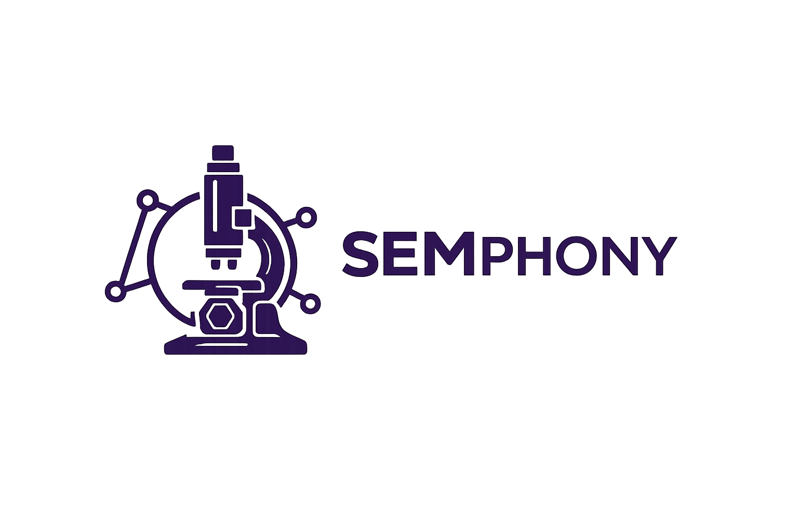

## Semphony

Semphony is a two-part system for managing and automating SEM (scanning electron microscope) workflows. It combines a Laravel-based control server with a Python-based device client to manage **systems**, **clients**, **commands**, and **logs**, with optional realtime control over WebSockets.

### Repository structure

- **`semphony-control-server/`** – Laravel 12 control server with a Livewire + Flux UI dashboard.
  - Authenticated dashboard to manage systems, connected clients, command dispatch, and correlated logs.
  - Authentication via Laravel Fortify (email verification, password resets, **2FA**).
  - Realtime updates via Laravel Reverb + Laravel Echo.
- **`semphony-device-client/`** – Python device client and tooling.
  - GUI automation and a Reverb/Pusher-compatible WebSocket client that connects device PCs to the control server.
  - Optional REST API mode and local LAN relay for multi-PC setups.
  - Validation / calibration utilities for device control flows.

### How it fits together

- The **control server** exposes a secured dashboard where authenticated, verified, and 2FA-enabled users can:
  - Register and monitor systems and clients.
  - Dispatch commands and inspect delivery status.
  - View and correlate logs across the platform.
- The **device client** connects back to the server over Reverb-compatible WebSockets (and optionally REST), authenticating with a client key and channel, and executing or relaying commands on device hardware.

### Getting started

For full setup instructions and details, see the sub-project READMEs:

- Control server (Laravel): `semphony-control-server/README.md`
- Device client (Python): `semphony-device-client/README.md`